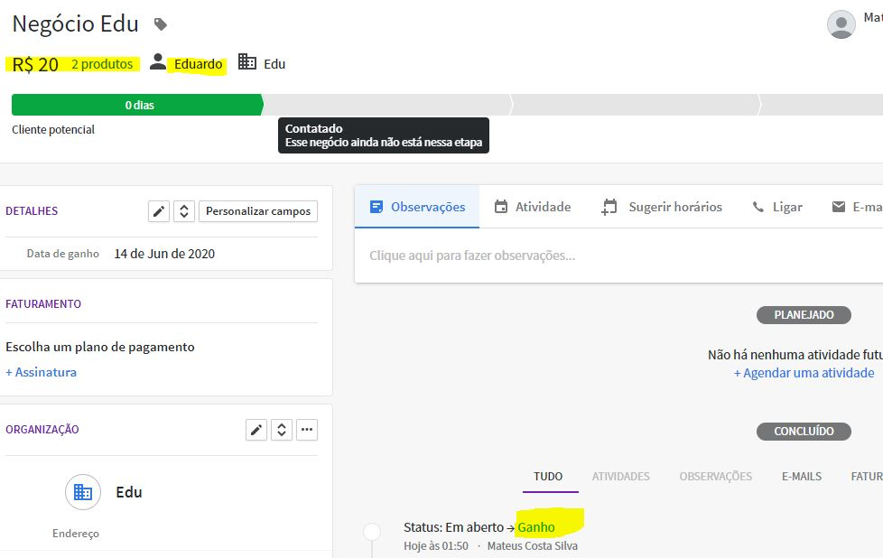

# linkApiProject

Project Link API

Integração das plataformas Pipedrive e Bling com NodeJS

<h3>1. Para fazer a integração é necessário fornecer algumas credenciais:</h3>
  <ul>
    <li>Api key do bling: Pode ser gerada no sistema web</li>
    <li>Api key do pipedrive: Pode ser gerada no sistema web</li>
    <li>MongoDB Password: Usada para acessar o mongodb atlas</li>
    <li>MongoDB user: gerado quando solicitamos a conexão com uma aplicação no mongodb atlas</li>
  </ul>
  <ul>
    <li>As credencias serão passadas para as seguintes variáveis</li>
    
  </ul>
<h3>Pata adicionar negócios do Pipedrive com o status igual a GANHO para o Bling como um pedido basta rodar a seguinte url: http://localhost:3333/addtobling  com o método POST</h3>
<ul>
  <li>Negócio com o status igual a ganho:</li>
  
  <li>Rodando a aplicação com o srcipt: "yarn dev:server" e rodando na url http://localhost:3333/addtobling com o método POST 

  
  <li>Os deals com o status igual a "won/ganho" são automáticamente adicionados como pedido no Bling</li>
  
</ul>
<h3>Para ultilizar o endpoint, basta mudar o médoto para GET, que então os dados salvos no banco de dados serão mostrados em json</h3>

