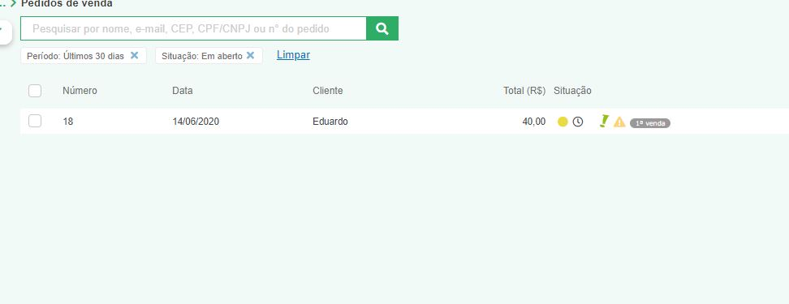

# linkApiProject

Project Link API

Integração das plataformas Pipedrive e Bling com NodeJS

<h3>1. Para fazer a integração é necessário fornecer algumas credenciais:</h3>
  <ul>
    <li>Api key do pipedrive: Pode ser gerada no sistema web</li>
    <li>Api key do bling: Pode ser gerada no sistema web</li>
    <li>MongoDB Password: Usada para acessar o mongodb atlas</li>
    <li>MongoDB user: gerado quando solicitamos a conexão com uma aplicação no mongodb atlas</li>
    <li>Não esquecer de mudar o nome do banco de dados(onde está "linkapi") no link de conexão do banco fica dentro do src/database/index.ts</li> 
  </ul>
  <ul>
    <li>As credencias serão passadas para as seguintes variáveis</li>
    
  </ul>

  <h3>2. Para adicionar negócios do Pipedrive com o status igual a GANHO para o Bling como um pedido basta rodar a seguinte url: http://localhost:3333/addtobling  com o método POST</h3>
  <ul>
    <li>Negócio com o status igual a ganho:</li>
    
    <li>Rodando a aplicação com o srcipt: "yarn dev:server" e rodando na url http://localhost:3333/addtobling com o método POST 

    
    <li>Os deals com o status igual a "won/ganho" são automáticamente adicionados como pedido no Bling</li>
    <li>O valor aparece no total como 40R$ porque foram adicionados dois itens na ordem de venda</li>
    
  </ul>

  <h3>3. Para ultilizar o endpoint, basta mudar o médoto para GET, que então os dados salvos no banco de dados serão mostrados em json</h3>
  
  <h3>Dados salvos no banco</h3>
  
  

    <ul>
      <li>Obs: Não passei todos os capos para a ordem do bling, porque fiquei confuso com a correspondencia de alguns campos entre as duas API'S, alguns eu nem encontrei, por isso a emissão da nfe mostra alguns avisos de obrigatoriedade de alguns campos, mas a ordem é gerada corretamente</li>
      
    </ul>
  

